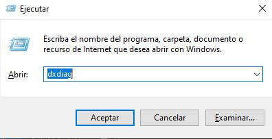
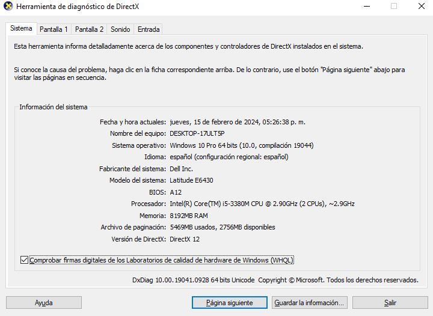
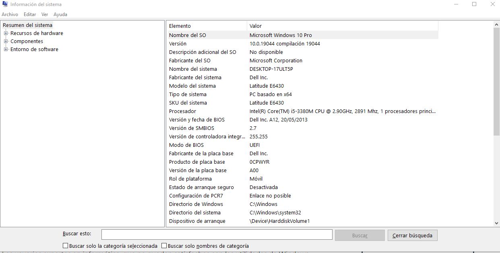

**Herramientas de Windows para Conocer las Especificaciones de tu PC**

En Windows, disponemos de varias herramientas integradas que nos permiten obtener información detallada sobre las especificaciones de nuestro equipo. Aquí te presento algunas de las más útiles:

1. **Atajo de Teclado Windows + Pause/Break**:
   - Al presionar esta combinación de teclas, abrirás una ventana con información básica sobre el CPU y la memoria RAM de tu PC. Estos son dos aspectos cruciales que proporcionan una visión general del rendimiento de tu sistema.

   

   
2. **DXDiag - Herramienta de Diagnóstico de DirectX**:
   - Utilizando el atajo de teclado Windows + R, abre la ventana de "Ejecutar" y escribe "dxdiag" para acceder a esta herramienta. DXDiag no solo proporciona detalles sobre el CPU y la memoria RAM, sino que también ofrece información detallada sobre la tarjeta gráfica y otros componentes relacionados con DirectX.

   

   

3. **Información del Sistema de Windows**:
   - Esta es la herramienta nativa más completa para conocer las características de tu PC. Para acceder a ella, simplemente escribe "Información del Sistema" en el menú de búsqueda de Windows o ejecútalo a través de la ventana "Ejecutar" con el comando "msinfo32".

   
